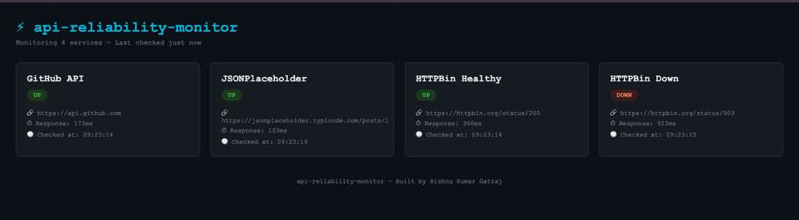

# API Reliability Monitor

Monitors availability and response time of HTTP services.
Exposes Prometheus-compatible metrics endpoint for observability.


## Dashboard




## Run with Docker

**Option 1 — Docker Compose (recommended)**

```bash
git clone https://github.com/Gatraj/api-reliability-monitor.git
cd api-reliability-monitor
docker-compose up --build
```

**Option 2 — Docker directly**

```bash
docker build -t api-reliability-monitor .
docker run -p 5003:5001 api-reliability-monitor
```

Visit http://localhost:5003

## Endpoints

| Route | Description |
|-------|-------------|
| `GET /` | Health dashboard |
| `GET /health` | Kubernetes liveness probe |
| `GET /metrics` | Prometheus scrape endpoint |

## Configuration

Services are configurable via the `MONITORED_SERVICES` environment variable.

Format: JSON array of objects with `name` and `url` fields.

```bash
docker run -p 5003:5001 \
  -e MONITORED_SERVICES='[{"name":"GitHub API","url":"https://api.github.com"},{"name":"HTTPBin Down","url":"https://httpbin.org/status/503"}]' \
  api-reliability-monitor
```

If not set, defaults to GitHub API, JSONPlaceholder, HTTPBin Healthy, and HTTPBin Down.

## Running Tests

```bash
cd app
python3 -m pytest tests/test_app.py -v
```

## Stack

- Python, Flask, Gunicorn
- Docker (multi-stage build)

## Roadmap

- [ ] GitHub Actions CI/CD pipeline
- [ ] Terraform — AWS EKS provisioning
- [ ] Kubernetes deployment
- [ ] ArgoCD GitOps
- [ ] Prometheus + Grafana observability
- [ ] AI-powered log analysis
