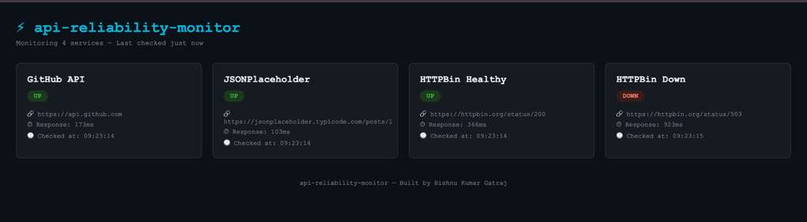
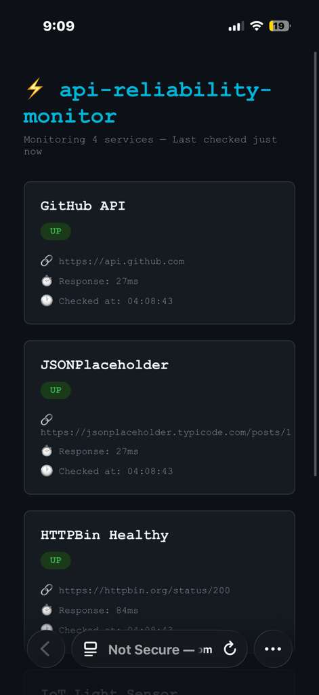
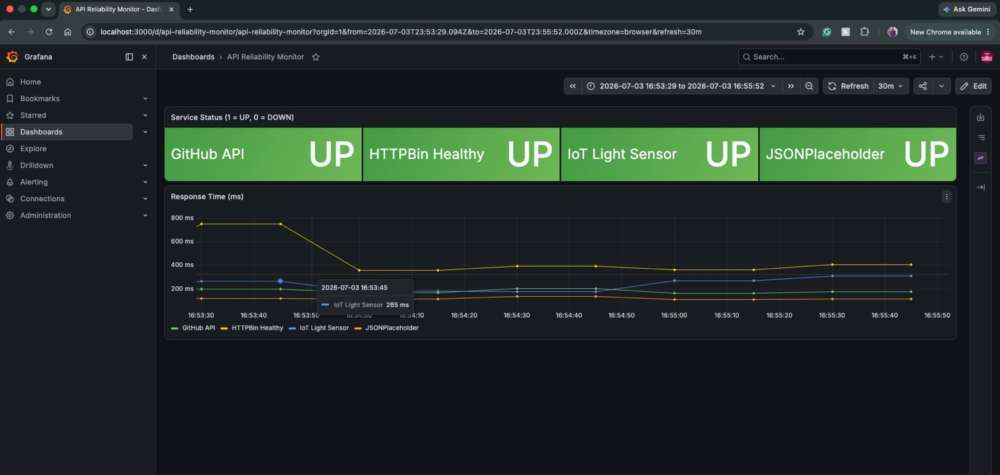
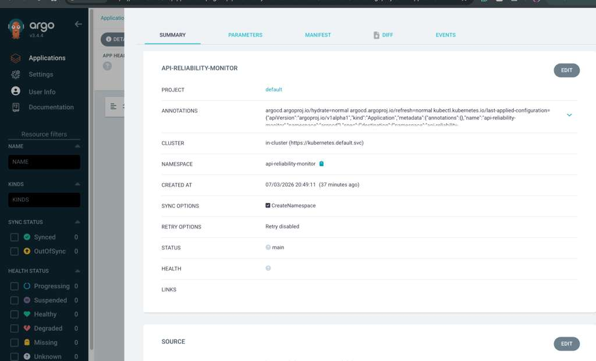
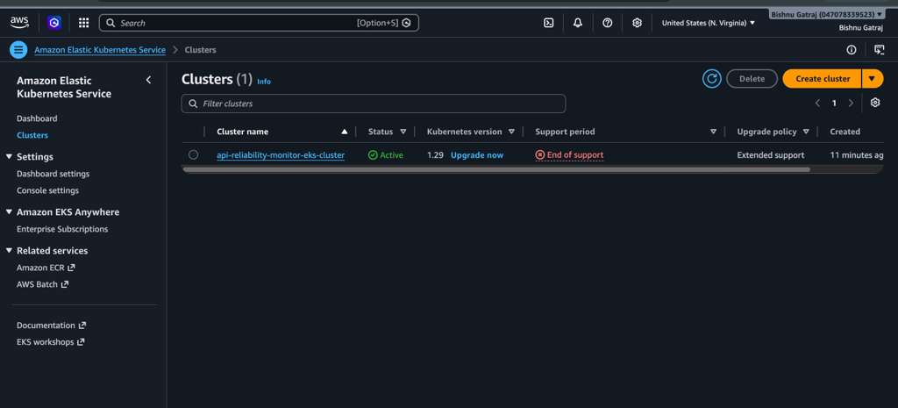
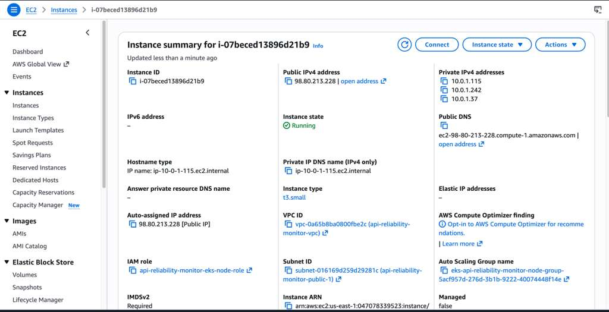
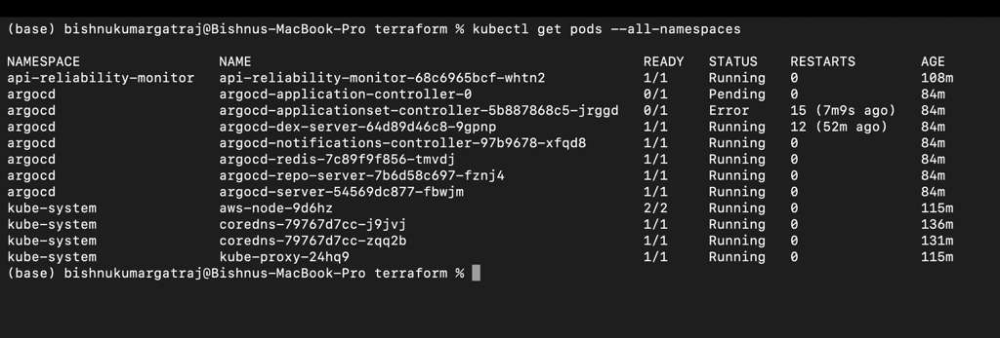

# API Reliability Monitor

An API monitoring platform that tracks the availability and response time of HTTP services in real time. Built with Flask and deployed on AWS EKS using Terraform, with a full CI/CD pipeline, GitOps deployment via ArgoCD, Prometheus and Grafana observability stack, and AI-powered log analysis using the Anthropic Claude API.


---

## Screenshots

### Monitoring Dashboard (AWS EKS — Public URL)


### Mobile View (Live on AWS)


### Grafana — Response Time Metrics


### ArgoCD — GitOps Deployment


### EKS Cluster — AWS Console


### EC2 Worker Node — t3.small


### Kubernetes Pods Running on EKS


---

## How It Works

The platform polls configured HTTP endpoints every 30 seconds and records:
- Whether the service is UP or DOWN
- Response time in milliseconds
- Timestamp of last check

Metrics are exposed via a `/metrics` endpoint in Prometheus format. Prometheus scrapes this endpoint and evaluates alerting rules. Grafana reads from Prometheus to display live dashboards.

When a pod has issues, the AI log analyzer fetches the logs via `kubectl` and sends them to Claude AI, which returns a plain-English root cause analysis and suggested fix.

---

## DevOps Workflow

```
Code pushed to GitHub
        ↓
GitHub Actions CI pipeline
  → Run tests (pytest)
  → Security scan (Trivy)
  → Build Docker image
  → Push to DockerHub
        ↓
ArgoCD detects changes in k8s/ folder
        ↓
Automatically deploys to AWS EKS cluster
        ↓
Prometheus scrapes /metrics every 30s
        ↓
Grafana displays live dashboards
        ↓
Alerts fire if service goes DOWN or response > 1000ms
```

---

## Tech Stack

| Area | Technology |
|------|-----------|
| Application | Python 3.12, Flask, Gunicorn |
| Containerization | Docker, DockerHub |
| CI/CD | GitHub Actions |
| Infrastructure | Terraform — AWS EKS, VPC, IAM |
| Orchestration | Kubernetes — Deployment, Service, ConfigMap, Ingress |
| GitOps | ArgoCD |
| Monitoring | Prometheus, Grafana |
| Alerting | Prometheus alerting rules |
| AI | Anthropic Claude API |

---

## Run Locally

```bash
git clone https://github.com/Gatraj/api-reliability-monitor.git
cd api-reliability-monitor
docker-compose up --build
```

| URL | Description |
|-----|-------------|
| http://localhost:5003 | Monitoring dashboard |
| http://localhost:9090 | Prometheus |
| http://localhost:3000 | Grafana (admin / admin) |

---

## Endpoints

| Route | Description |
|-------|-------------|
| `GET /` | Service health dashboard |
| `GET /health` | Kubernetes liveness probe |
| `GET /metrics` | Prometheus scrape endpoint |

---

## Deploy to AWS EKS

```bash
# Provision infrastructure
cd terraform
terraform init && terraform apply

# Connect kubectl
aws eks update-kubeconfig --name api-reliability-monitor-eks-cluster --region us-east-1

# Deploy application
kubectl apply -f k8s/

# Install ArgoCD
kubectl create namespace argocd
kubectl apply -n argocd -f https://raw.githubusercontent.com/argoproj/argo-cd/stable/manifests/install.yaml
kubectl apply -f k8s/argocd-app.yaml

# Destroy infrastructure when done
cd terraform && terraform destroy
```

---

## AI Log Analyzer

```bash
cd ai-logs
pip install -r requirements.txt
export ANTHROPIC_API_KEY=sk-ant-...
python analyzer.py <pod-name>
```

Fetches the last 100 lines of pod logs via `kubectl`, sends them to Claude AI, and streams a root cause analysis with a suggested fix directly to the terminal.

---

## Alerting Rules

| Alert | Condition | Severity |
|-------|-----------|----------|
| ServiceDown | Service unreachable for 1 minute | Critical |
| HighResponseTime | Response time > 1000ms for 2 minutes | Warning |

---

## Infrastructure

- EKS cluster running Kubernetes 1.31 in us-east-1
- t3.small worker node with min=1 / max=2 scaling config
- VPC with public and private subnets across 2 availability zones
- IAM roles for EKS control plane and worker nodes following least-privilege

---

## Project Structure

```
api-reliability-monitor/
├── app/                    # Flask application + tests
├── ai-logs/                # AI log analyzer
├── k8s/                    # Kubernetes manifests
├── monitoring/             # Prometheus + Grafana config
├── terraform/              # AWS infrastructure
├── .github/workflows/      # CI/CD pipeline
├── Dockerfile
└── docker-compose.yml
```

---

## Running Tests

```bash
cd app && python3 -m pytest tests/test_app.py -v
```

---

Built by **Bishnu Kumar Gatraj** · [GitHub](https://github.com/Gatraj/api-reliability-monitor)
